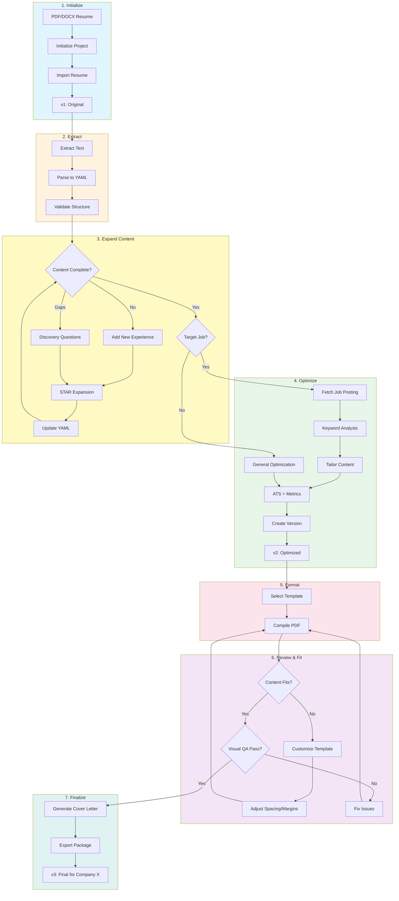
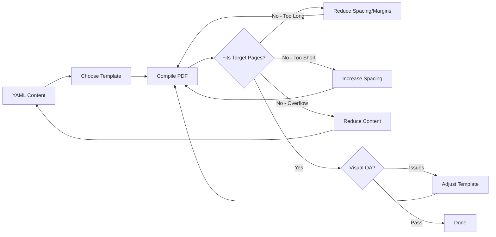
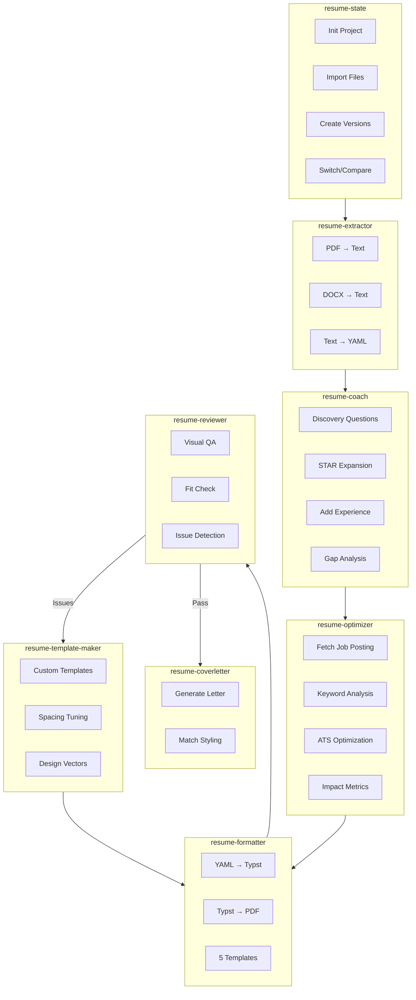
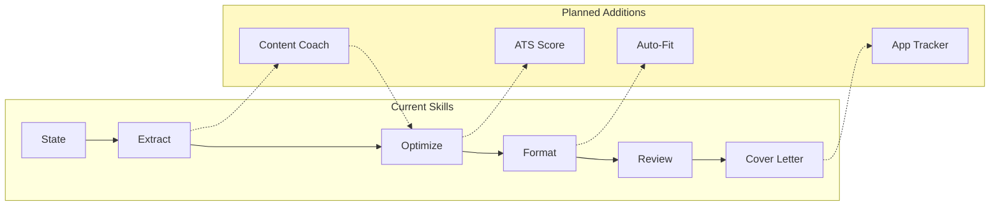

# Resume Skills for Claude Code

Seven skills for resume management: extract PDF/DOCX → optimize content → format to PDF → generate cover letters → review and iterate.

[](https://opensource.org/licenses/MIT)
[](https://claude.com/code)

## Installation

```bash
/plugin marketplace add https://github.com/vibewith-brent/claude-resume-skills
/plugin install resume-skills@resume-helper-skills
```

After installation, use skills via natural language (e.g., "Extract my resume from resume.pdf").

### Updating Skills

```bash
/plugin update resume-skills@resume-helper-skills
```

After updating, **restart Claude Code** or start a new conversation to load the updated skills.

### Prerequisite

[Typst](https://typst.app) must be installed (`brew install typst`).

## Workflow Overview

The complete resume workflow with versioning at each stage:



### Core Loop: Content → Template → Fit

Most time is spent in the format/review loop, customizing templates to fit content:



### Skill Responsibilities



## Skills

| Skill | Purpose |
|-------|---------|
| **resume-state** | Version control. Initialize projects, import files, branch versions, compare changes. *Use first.* |
| **resume-extractor** | Convert PDF/DOCX to structured YAML |
| **resume-coach** | Discover and expand content through guided questions. Add experience, fill gaps, articulate achievements. *(New)* |
| **resume-optimizer** | Improve content: ATS optimization, metrics, keyword alignment, job tailoring |
| **resume-formatter** | Generate PDFs from YAML using Typst templates |
| **resume-coverletter** | Generate cover letters matching resume template styling |
| **resume-reviewer** | Visual QA templates — Claude views PDF and fills in checklist |
| **resume-template-maker** | Create custom Typst templates for content fitting |

### Templates (Starting Points)

Templates are starting points, not final solutions. Most resumes need template customization to fit content on target pages.

| Template | Best For | Key Traits |
|----------|----------|------------|
| `executive` | 2-page professional | Clean hierarchy, navy accents, balanced spacing |
| `tech-modern` | Creative/startup | Lavender palette, pill skills, single-page optimized |
| `modern-dense` | Extensive experience | Maximum density, inline skills, ~20-25 bullets |
| `compact` | 1-page constraint | Tight margins, minimal section gaps |
| `minimal` | Understated | Monochromatic, maximum readability |

## Usage

Skills auto-select based on your request. Example workflow:

```
"Initialize project ml_engineer and import resume.pdf"
"Extract to YAML and optimize for ATS"
"Create version for Google, tailor for this job: [URL]"
"Generate PDF with executive template"
"The content overflows - adjust the template to fit on 2 pages"
"Write a cover letter for this role"
"Review the PDF"
```

CLI equivalents in each skill's `scripts/` directory.

## Structure

```
resume-*/              # Skill directories (SKILL.md + scripts/ + references/)
.claude-plugin/        # Plugin marketplace configuration
.resume_versions/      # Version store (projects, sources, versions)
```

## YAML Schema

**Required:** `contact`

**Recommended:** `summary`, `experience`, `skills`, `education`

**Optional:** `certifications`, `projects`, `publications`, `awards`, `languages`, `volunteer`

Experience supports nested positions (multiple roles at same company). Full schema: `resume-extractor/references/resume_schema.yaml`

The formatter validates YAML against the schema before rendering. Use `--skip-validation` for legacy formats:

```bash
uv run resume-formatter/scripts/yaml_to_typst.py resume.yaml executive --skip-validation
```

## Troubleshooting

| Issue | Fix |
|-------|-----|
| Skills not loading | Check `/plugin list`; reinstall with `/plugin install resume-skills@resume-helper-skills` |
| Schema validation failed | Fix YAML structure per error messages, or use `--skip-validation` for legacy formats |
| Typst errors | Check `typst --version`; escape special chars in YAML |
| Content overflow | Reduce bullets (4-6/role), try `compact` template |
| State not found | Run `init_project.py <name>` |

## Development

```bash
uv sync              # Install dependencies
uv sync --extra dev  # Include test dependencies
```

### Local Development

**Use plugin marketplace only.** Do not create `.claude/skills/` symlinks — this causes duplicate skills to appear (once as `(project)` and again as `(plugin)`).

Workflow:
1. Modify skill sources in `resume-*/` directories
2. Run `/plugin update resume-skills@resume-helper-skills`
3. Restart Claude Code or start a new conversation
4. Test changes

### Testing

```bash
uv run pytest tests/           # Run all tests
uv run pytest tests/ -v        # Verbose output
uv run pytest tests/ --cov     # With coverage
```

### Adding Skills

1. Create `resume-newskill/SKILL.md`:
   ```yaml
   ---
   name: resume-newskill
   description: What it does and when to use it. Third person.
   ---
   ```
2. Add `scripts/` and `references/` as needed
3. Add skill path to `.claude-plugin/marketplace.json`

See [Skill Authoring Best Practices](https://docs.anthropic.com/en/docs/agents-and-tools/claude-code/skills#authoring-best-practices).

## Roadmap & Known Gaps

Current gaps and potential improvements:

### Content Discovery & Coaching (High Priority Gap)

The current flow assumes resume content already exists. Missing: helping users discover, create, and expand content.

| Gap | Description | Priority |
|-----|-------------|----------|
| **Achievement Discovery** | Interview-style questions to help users remember forgotten accomplishments | High |
| **Skills Coaxing** | Draw out hidden skills from side projects, hobbies, volunteer work | High |
| **Content Generation** | Create new bullets from scratch based on role descriptions | High |
| **Experience Updates** | Guided flow for adding recent work experience | High |
| **Gap Analysis** | Identify what's missing for target role, help create that content | High |
| **STAR Expansion** | Take basic bullets and expand with Situation, Task, Action, Result | Medium |

**Example coaching questions:**
- "What's the biggest problem you solved in this role?"
- "Did you save time, money, or reduce errors? By how much?"
- "What tools/technologies did you use that aren't listed?"
- "Any projects outside work that demonstrate these skills?"

### Content Analysis
| Gap | Description | Priority |
|-----|-------------|----------|
| **ATS Scoring** | Automated scoring of resume against job description (keyword match %, format compliance) | High |
| **Content Analytics** | Word count, keyword density, bullet length analysis, reading level | Medium |
| **Duplicate Detection** | Flag similar bullets across roles, suggest consolidation | Low |

### Template & Formatting
| Gap | Description | Priority |
|-----|-------------|----------|
| **Template Preview** | Side-by-side preview of all templates with same content | High |
| **Auto-Fit** | Automatically adjust spacing to hit target page count | High |
| **Multi-Column Layout** | Two-column and sidebar template variants | Medium |
| **Dark Mode Templates** | Templates optimized for on-screen viewing | Low |

### Workflow & Integration
| Gap | Description | Priority |
|-----|-------------|----------|
| **Application Tracker** | Track which versions sent to which companies, response status | High |
| **LinkedIn Import** | Extract resume data from LinkedIn profile URL | Medium |
| **Job Board Integration** | Direct fetch from LinkedIn, Indeed, Greenhouse job postings | Medium |
| **Version Comparison PDF** | Visual diff of two resume PDFs side-by-side | Medium |

### AI Enhancements
| Gap | Description | Priority |
|-----|-------------|----------|
| **Industry Benchmarking** | Compare resume against successful examples in same field | Medium |
| **Interview Prep** | Generate likely interview questions from resume content | Low |

### Contributions Welcome

PRs welcome for any of the above. See [Contributing](#contributing) for guidelines.



## Contributing

PRs welcome. Priority areas:
- **Content coaching** - Interview-style discovery, STAR expansion, gap analysis
- **ATS scoring** - Keyword match %, format compliance scoring
- **Auto-fit** - Automatic spacing adjustment to hit target pages
- **Application tracking** - Track versions sent to companies

## License

MIT — see [LICENSE](LICENSE)

## Resources

- [Typst](https://typst.app) — Modern typesetting
- [Claude Code Skills](https://docs.anthropic.com/en/docs/agents-and-tools/claude-code/skills) — Official docs
- [Claude Code Plugins](https://docs.anthropic.com/en/docs/agents-and-tools/claude-code/plugins) — Plugin marketplace docs

---

[Issues](https://github.com/vibewith-brent/claude-resume-skills/issues) · [Discussions](https://github.com/vibewith-brent/claude-resume-skills/discussions)
